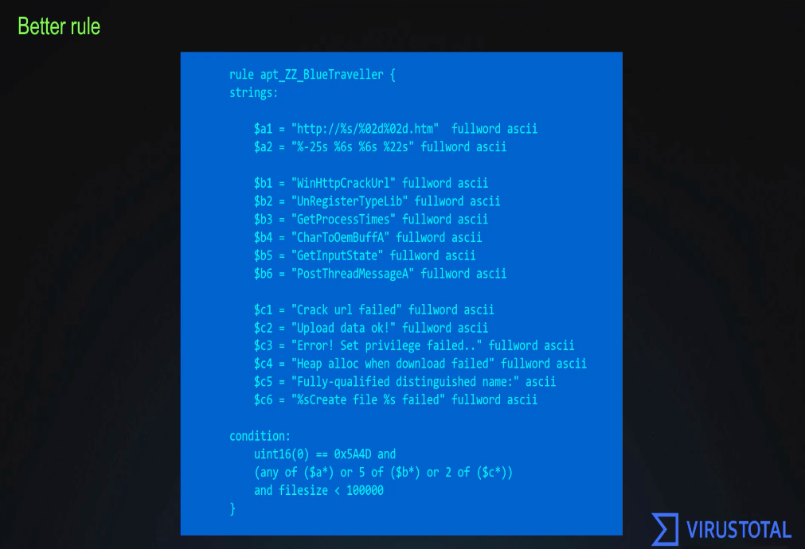
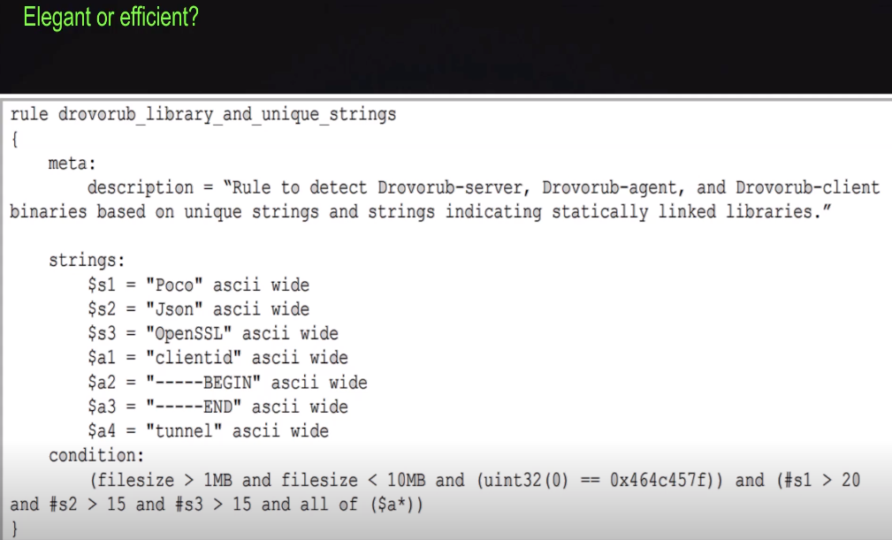

## Various Yara Notes 


### From VT/KAS Webinar 
(https://www.brighttalk.com/webcast/18282/504513).

- grep on steroids 
- give it a name, description, strings to match, and a condition 
    - Out of these, condition is mandatory 
- YARA is also often integrated within commercial detection tools, or used internally to detect binaries on the enterprise network
- if you don't specify char set, it will default to ascii

More info on why here
(https://yara.readthedocs.io/en/stable/writingrules.html#text-strings).


#### boilerplate placeholder for a rule 
```
rule sample_rule {
    meta: 
        author: author_name
        description: "rule for a proof of concept"

    strings:  
        $a="hash_1" 
        $b="hash_2"
        $c="hash_3"
    
    condition: 
        ($a or $b or $c)
}
```

#### Yara rule to hunt for a file in a spefic timerange 

```
rule_hunt_by_timestamp 
{
    meta:
        author:author_name
        description: "rule to hunt in a specific timerange"

        strings:
            $a=".pdf"
        
        condition:
            pe.timestamp > 1670581513 // Friday, December 9, 2022 10:25 AM UTC
            and pe.timestamp < 1670781713 // Sunday, December 11, 2022 6:01 PM UTC
}
```

#### In the weeds
Testing 
- test with malware samples
- test with CLEAN datasets

keywords
- uint16 read 2 bytes (16 bits) from a binary file as unsigned integer
    - ex:  uint16(0) == 0x5A4D // MZ magic number
- any of

Conditions 
 - use strings command, then include unqoue strings in rule (strings)
 - group specific non-unique strings
    - 3 from group a, 2 from group b, 1 from group c 
    - any of keywords
<br><br/>

    

- here, grouping is used to detect on a combination of a group, b group, or c group 

#### Modules
- Make life easier 
- most common being PE module  
- other modules: Cuckoo, ELF, Magic, Hash, Time


#### yara rule from local Mac OSX XProtect.yara
```
rule PrxlA
{
    meta:
        description = "OSX.Prxl.2"
        xprotect_rule = true
    condition:
        Macho and filesize <= 24000 and
        (
            hash.sha1(0, filesize) == "edff0cd0111ee1e3a85dbd0961485be1499bdb66" or
            hash.sha1(0, filesize) == "429ed6bced9bb18b95e7a5b5de9a7b023a2a7d2c" or
            hash.sha1(0, filesize) == "f1a32e53439d3adc967a3b47f9071de6c10fce4e"
        )
}
```
For Icefog malware 
(https://www.thesafemac.com/apple-finally-adds-icefog-to-xprotect/).

### Another example rule: Good or Bad? 



- Can count the amount of times a given string is found with #s2 > #s3 syntax

(https://yara.readthedocs.io/en/v3.4.0/writingrules.html#counting-strings).

Suggested "Clean" samples
https://www.microsoft.com/en-us/download


#### References 

- https://blog.virustotal.com/2021/09/applied-yara-training-q.html
- https://www.brighttalk.com/webcast/18282/504513
- https://blogs.blackberry.com/en/2022/11/cyber-threat-hunting-2-powerful-analysis-tools
- https://github.com/Neo23x0/yarGen